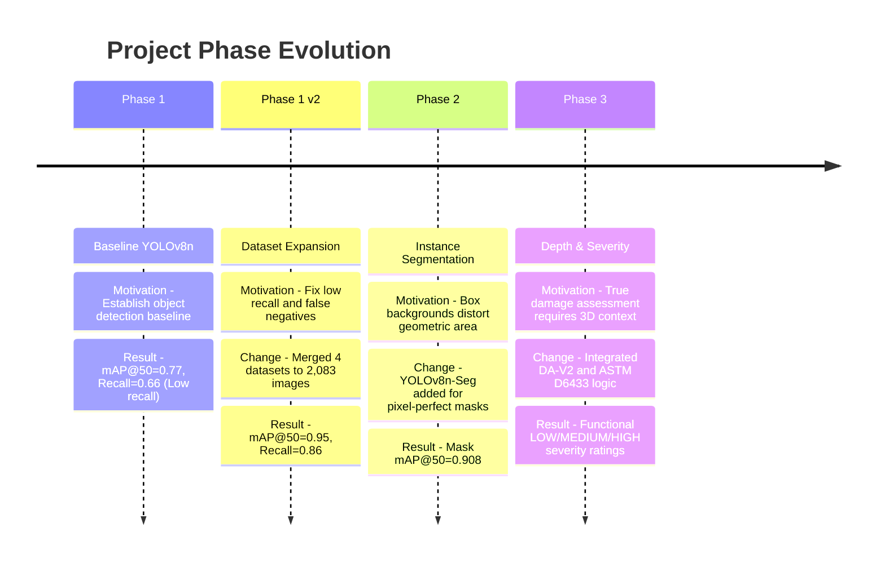

# 10. Project History & Evolution

This project underwent rigorous iterative development to solve specific bottlenecks discovered during evaluation.

```mermaid
timeline
    title Project Phase Evolution
    Phase 1 : Baseline YOLOv8n
            : Motivation - Establish object detection baseline
            : Result - mAP@50=0.77, Recall=0.66 (Low recall)
    Phase 1 v2 : Dataset Expansion
               : Motivation - Fix low recall and false negatives
               : Change - Merged 4 datasets to 2,083 images
               : Result - mAP@50=0.95, Recall=0.86
    Phase 2 : Instance Segmentation
            : Motivation - Box backgrounds distort geometric area
            : Change - YOLOv8n-Seg added for pixel-perfect masks
            : Result - Mask mAP@50=0.908
    Phase 3 : Depth & Severity
            : Motivation - True damage assessment requires 3D context
            : Change - Integrated DA-V2 and ASTM D6433 logic
            : Result - Functional LOW/MEDIUM/HIGH severity ratings

```
